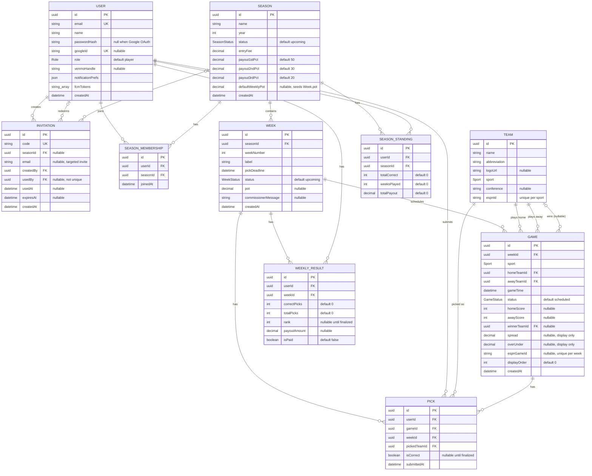

# Database — PostgreSQL 16 + Prisma

## What it is

Postgres is the system of record — every user, pick, game, and result lives here. [Prisma](https://www.prisma.io) is the ORM: you describe tables in a schema file, Prisma generates a fully-typed TypeScript client from it, and generates/runs SQL migrations for you. Per CLAUDE.md, raw SQL is banned — every query in the codebase goes through Prisma's query API (`prisma.pick.findMany(...)`, etc.), never `$queryRaw`.

## How it works

**Schema**: [backend/src/prisma/schema.prisma](../../backend/src/prisma/schema.prisma) — this one file is the entire source of truth for the database structure. Current models:

- `User` — email/password or Google OAuth (`passwordHash` is nullable), role (`player`/`commissioner`/`admin`), notification prefs (JSON blob), FCM device tokens (string array)
- `Invitation` — one-time invite codes, optionally targeted to an email, optionally scoped to a season
- `Season` — a year of the pickem, payout percentages for 1st/2nd/3rd place
- `Week` — belongs to a season, has a `pickDeadline` and a `pot` (this week's payout pool)
- `Team` — cached from ESPN, scoped by `(sport, espnId)` since ESPN reuses small integer IDs across NFL and college
- `Game` — belongs to a week, references two teams, carries live score/status/winner once played
- `Pick` — one user's pick for one game (`@@unique([userId, gameId])` enforces one pick per game)
- `WeeklyResult` — a user's rank/payout for a completed week
- `SeasonStanding` — a user's cumulative record across the season

All primary keys are UUIDs (`@default(uuid())`), per CLAUDE.md convention. Enums (`Role`, `Sport`, `WeekStatus`, `GameStatus`, etc.) are Postgres native enums, mapped 1:1 to TypeScript string-literal unions by Prisma.

**Entity-relationship diagram** (generated from `schema.prisma` — regenerate by hand if the schema changes):

A few constraints worth calling out that don't show up as boxes and arrows:

- **`SeasonMembership`** is the junction table for the User↔Season many-to-many — a player can belong to more than one pool at once (e.g. a preseason test pool alongside the main season). `@@unique([userId, seasonId])` just stops joining the same pool twice; it's also what "active season" / "current week" resolution filters by.
- **`Team.espnId`** is unique per `(sport, espnId)`, not globally — ESPN reuses small integer IDs across leagues, so the same numeric ID can point to one NFL team and one unrelated college team.
- **`Game.espnGameId`** is unique per `(weekId, espnGameId)`, not globally — the same real-world matchup can be independently selected into more than one pool's week at once, so a global constraint would collide.
- **`Pick.weekId`** is denormalized onto the row (rather than derived through `gameId → Game.weekId`) to keep weekly pick queries a single-table scan, alongside the `@@unique([userId, gameId])` one-pick-per-game rule.
- **`Invitation.usedBy`** is deliberately not unique — a user redeems a distinct invite code per pool they join, so the same user can appear on multiple invitation rows over time.

**Migrations**: every schema change is captured as a numbered SQL file under [backend/src/prisma/migrations/](../../backend/src/prisma/migrations/). There are 4 so far: `initial`, `team_espn_id_scoped_by_sport`, `add_weekly_pot_fields`, `add_fcm_tokens`. Running `npm run db:migrate` (`prisma migrate dev`) diffs your edited schema against the migration history, generates a new migration file, and applies it. This is a one-way ratchet in the intended workflow — you edit `schema.prisma`, Prisma writes the SQL, you don't hand-write migration SQL.

## Where it runs

The `postgres` service in [docker-compose.yml](../../docker-compose.yml): `postgres:16-alpine` image, database name `coffey_pickem`, user `coffey`. Data persists in a named Docker volume (`postgres_data`), not in the container itself — the container can be destroyed and recreated without losing data as long as the volume survives.

Right now (checked this session) it's running locally on this dev machine, port `5432` exposed to the host (`ports:` in compose has a `# expose for local dev only; remove in prod` comment — production shouldn't expose 5432 to the outside world at all, only the `api` container should reach it, over the internal Docker network).

Connection string lives in `.env` as `DATABASE_URL` — see [.env.example](../../.env.example) for the shape.

## How to view it

Three options, roughly easiest to most powerful:

1. **Prisma Studio** — `cd backend && npm run db:studio` (runs `prisma studio`). Opens a web GUI at `http://localhost:5555` where you can browse/edit every table visually. Easiest way to just look at data.
2. **psql inside the container** — `docker exec -it coffey_club_pickem-postgres-1 psql -U coffey -d coffey_pickem`. Raw SQL access if you want to run ad-hoc queries.
3. **A desktop GUI client** (TablePlus, DBeaver, Postico) — point it at `localhost:5432`, database `coffey_pickem`, user `coffey`, password from `POSTGRES_PASSWORD` in your `.env`. Same local port-forward the app itself uses.

To check migration state without opening anything: `cd backend && npx prisma migrate status`.

## Status in this project

Confirmed this session: container is up and healthy, all 4 migrations applied, schema is up to date, and the live API server successfully reads/writes through it.
